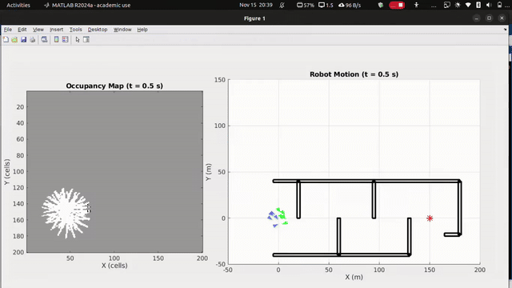

# Multi-Robot SLAM Navigation

A MATLAB simulation of collective navigation for a multi-robot swarm in an unknown environment. Built as a three-stage enhancement over the baseline decentralized flocking framework of Olcay et al. [1], adding environmental memory via SLAM, deadlock escape via a novel DDR mechanism, and real-world robustness via a Delayed Self-Reinforcement (DSR) filter.

**Course:** ME5253 — Network Dynamics & Controls in Mechanical Engineering, IIT Madras  
**Authors:** Aadityanshu Abhinav (ME22B088), Ajan Muthuraj (ME22B100)

---

## Demo

<!-- Replace with your recorded GIF -->


---

## Overview

Traditional flocking models (e.g., Olfati-Saber) use only local neighbor interactions and fail in unknown, cluttered environments. This project addresses three key weaknesses of such reactive systems:

| Weakness | Our Enhancement |
|---|---|
| No memory — robots re-explore the same areas | SLAM layer with shared occupancy grid |
| Deadlock in maze-like traps | Deadlock Detection & Recovery (DDR) |
| Perfect sensing assumed | Delayed Self-Reinforcement (DSR) filter |

The result: a swarm that achieves **100% goal convergence** in corridor maze environments where the baseline fails 30% of the time, with **92% exploration coverage** vs 65% baseline.

---

## Control Law

Each agent `i` computes its control input from three decentralized terms:

```
u_i = u_alpha + u_beta + u_gamma + u_dsr
```

- **u_alpha** — Flocking: inter-agent spacing and velocity consensus using smooth sigma-norm potentials
- **u_beta** — Avoidance: obstacle repulsion with tangential wall-following state machine
- **u_gamma** — Goal: attraction to the virtual/real goal with damping
- **u_dsr** — DSR filter (Stage 3 only): velocity smoothing for sensor noise robustness

---

## Three-Stage Enhancement

### Stage 1 — SLAM Integration
Each robot runs a simulated LiDAR with ray-tracing to update a local occupancy grid:
- Cells along the ray → marked **Free (1)**
- Endpoint cell → marked **Occupied (-1)**
- Behind obstacles → remains **Unknown (0)**

Local maps are periodically merged into a shared global map, giving the swarm environmental memory and preventing redundant re-exploration.

### Stage 2 — Deadlock Detection & Recovery (DDR)
An agent declares itself **stuck** if its distance to goal does not decrease sufficiently over a monitoring interval:

```
if Δd_goal < ε_p for t > T_s  →  STUCK
```

When >60% of agents are simultaneously stuck, a group escape maneuver fires — each agent adds a randomized directional perturbation to break the trap symmetry:

```
u_escape = λ · [cos(θ_i), sin(θ_i)]ᵀ
```

### Stage 3 — Sensor Noise & DSR Filter
Gaussian noise on obstacle detection creates jittery repulsive forces causing oscillation. The DSR filter adds a velocity-damping term that penalises rapid changes, acting as "momentum":

```
u_dsr = k · (v_i(t - D) - v_i(t))
```

With `k = 0.8` and delay `D = 5` steps (0.1s), the filter restores smooth tangential wall-following under noise.

---

## Repository Structure

```
├── Code/
│   ├── final_v2_0.m          # Stage 1+2: SLAM + DDR (ideal sensing)
│   ├── final_v2_1.m          # Stage 3: SLAM + DDR + DSR (noisy sensing)
├── Demonstrations/            # Recorded simulation videos and GIFs
├── Presentation/              # ME5253 final presentation slides (PDF)
```

---

## Requirements

- MATLAB R2020b or later
- No additional toolboxes required — all simulation logic is self-contained

---

## Running the Simulation

**Stage 1+2 (ideal sensing):**
```matlab
run Code/final_v2_0.m
```

**Stage 3 (noisy sensing + DSR):**
```matlab
run Code/final_v2_1.m
```

### Selecting an Environment
At the top of either file, change the `scenario` variable:

```matlab
scenario = 'corridor_maze';  % 'zigzag' | 'two_circles' | 'semicircle' | 'corridor_maze'
```

| Scenario | Description |
|---|---|
| `zigzag` | Zigzag wall, goal above |
| `two_circles` | Two circular obstacles side by side |
| `semicircle` | Large semicircular trap |
| `corridor_maze` | Complex maze designed to defeat the baseline |

---

## Key Parameters

| Parameter | Default | Description |
|---|---|---|
| `params.N` | 10 | Number of robots in the swarm |
| `params.dt` | 0.02 s | Simulation timestep |
| `params.t_max` | 150 s | Total simulation time |
| `params.rs` | 20 m | LiDAR sensing radius |
| `params.rc` | 30 m | Inter-robot communication radius |
| `params.v_max` | 4 m/s | Maximum velocity |
| `params.d_alpha` | 10 m | Desired inter-agent spacing |
| `params.stuck_check_interval` | 20 s | How often stuck-detection checks progress |
| `params.force_escape_group_frac` | 0.6 | Fraction of stuck agents to trigger group escape |
| `params.DSR_gain` | 0.8 | DSR filter gain `k` |
| `params.DSR_delay_steps` | 5 | DSR delay in timesteps (= 0.1 s) |

---

## Results

Performance in the Corridor Maze environment (10 runs):

| Metric | Baseline (Olcay et al.) | This Work |
|---|---|---|
| Goal Convergence Rate | 70% | **100%** |
| Average Time to Goal | ~180 s | **~140 s** |
| Exploration Coverage | 65% | **92%** |
| Deadlock Frequency | High | Low (1 event) |

The DSR filter successfully restores navigation under Gaussian sensor noise with no degradation in convergence.

---

## Stability Analysis

The core control law is Lyapunov-stable. The energy function:

```
V = Σ Σ ϕ(σ(p_j - p_i)) + Σ ‖v_i‖²
```

has `V̇ ≤ 0` due to strictly dissipative damping terms, guaranteeing agent convergence to a collision-free, zero-relative-velocity state. The DSR term acts as additional velocity damping, further stabilising the system under noisy sensing.

---

## References

1. A. Olcay and D. Dimov, "Collective navigation of a multi-robot system in an unknown environment," *IFAC-PapersOnLine*, 2020.
2. R. Olfati-Saber, "Flocking for multi-agent dynamic systems: Algorithms and theory," *IEEE Transactions on Automatic Control*, 2006.
3. D. Fox, W. Burgard, and S. Thrun, "Distributed multi-robot exploration and mapping," *Proceedings of the IEEE*, 2006.
4. G. Grisetti et al., "A tutorial on graph-based SLAM," *IEEE Intelligent Transportation Systems Magazine*, 2010.

---

## Acknowledgements

We thank **Dr. Anuj K. Tiwari** for guidance during ME5253 at IIT Madras.
